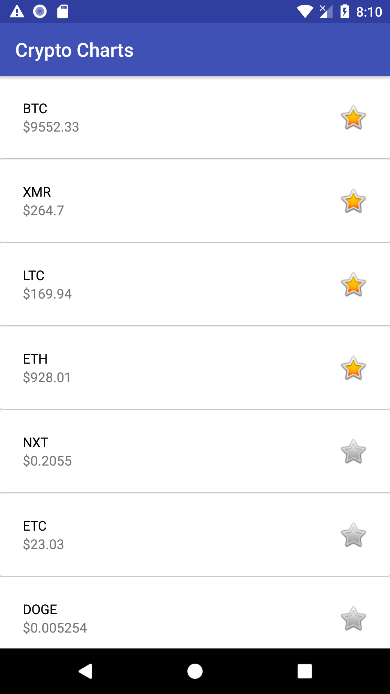
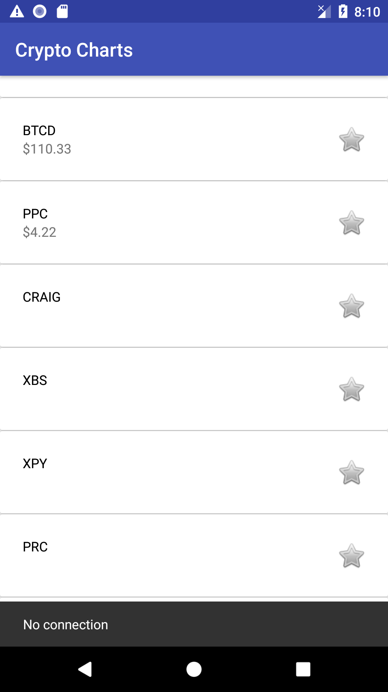
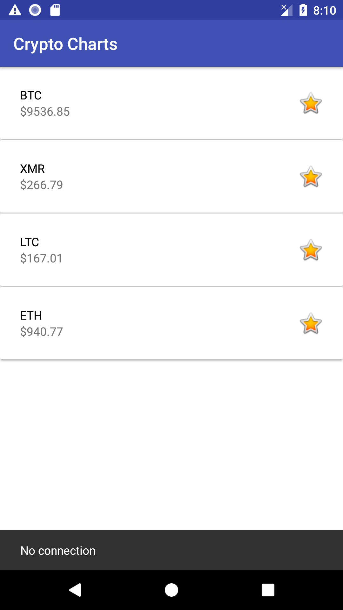

# SymbilityIntersect-CodeChallenge1

This is my implementation of all the features requested by the mobile engineer challenge for the Android platform. The following are additional features, I added to optimize the behaviour:
<ul>
    <li>Snackbar to notify if the user is disconnected from network and attempting API calls. This is dismissed subsequent to the next API call where connection is available.</li>
</ul>

<h3>Tools/Libraries Used:</h3>
<ul>
  <li>Butterknife</li>
  <li>Retrofit</li>
  <li>Room</li>
  <li>RxJava</li>
</ul>

<h3>Challenges</h3>
<ol>
  <li> 
    <b>Deciding When to Fetch Price Responses</b>
    
I debated whether to retrieve all the prices before the list of coins was shown. However, due to the large amount of calls (approx. 2000), it would take about 30 secs to have all data ready. This would diminish the user experience. Thus, I switched to retrieving the price when the view was being binded (and doing it on a background thread as well).

    
 <b>Unsuccessful API calls:</b>
      I hid the price completely, and later added in a snackbar to notify if it was caused by no network connection. I left the price as null, to ensure another API call could be made on the next binding.</a>
    

  </li>
  <li>
    <b>Using Unoptimal Approach For Splash Screen</b>
    
Due to the requirements asking for text on the splash screen and lack of resources tweaking the optimal approach, I had to take the alternate approach which had some edge cases resulting in bugs. Luckily, I was able to find a <a href="https://medium.com/@AkhilDad/splash-screens-usability-and-common-bug-71c6bea33f20">Medium post<a> discussing these issues and their resolution.

  </li>
  <li>
    <b>What to Store in Database</b>
    
Due to the large amount of coin data, I debated whether it was worth saving some of the unfavourited data such that user can observe it with no connection during the initial API call. However, I didn't think it would useful as the price data would be old and meaningless to provide functionalities for it. Hence, I only stored the favourited coin data in the database and showed them for the aforementioned case. See screenshots below for its UI state.

  </li>
</ol>

<h3>Drawbacks</h3>
<ul>
  <li> 
    <b>Using Recycler View & Making API calls for Missing Prices</b>
    
Some price API responses are susceptible of arriving later or failing completely. Hence, changes to the UI of the price are somewhat noticable when user swipes down quickly; it came at cost of minimizing the aforementioned time to prepare the list.

  </li>
</ul> 

<h3>Screenshots</h3>

  
  
  

